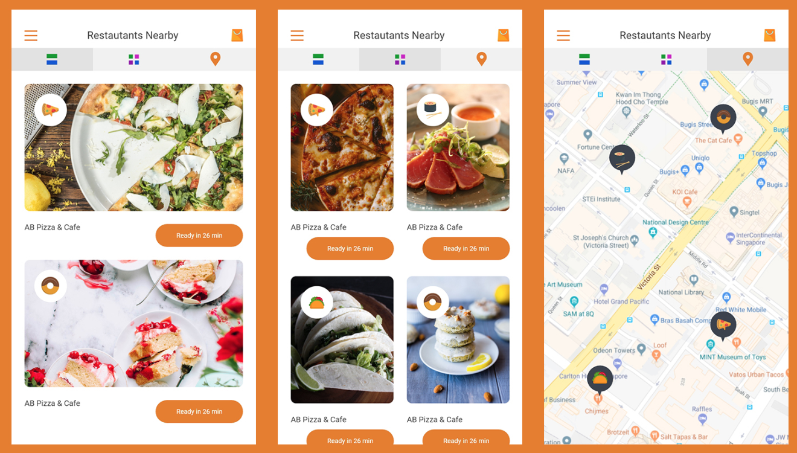
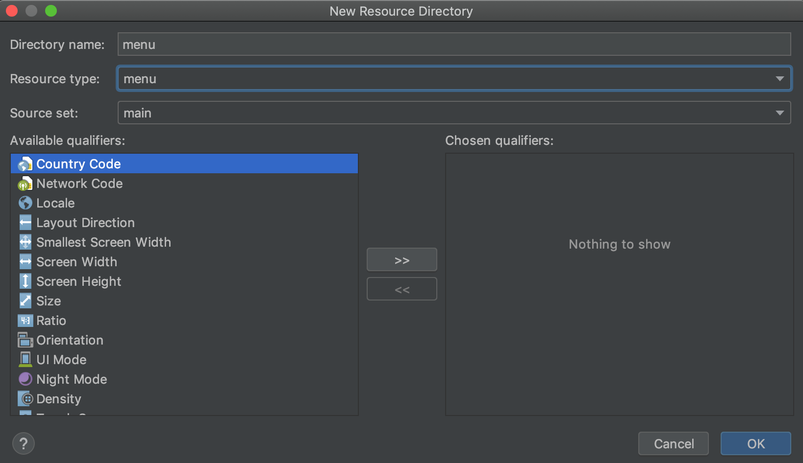
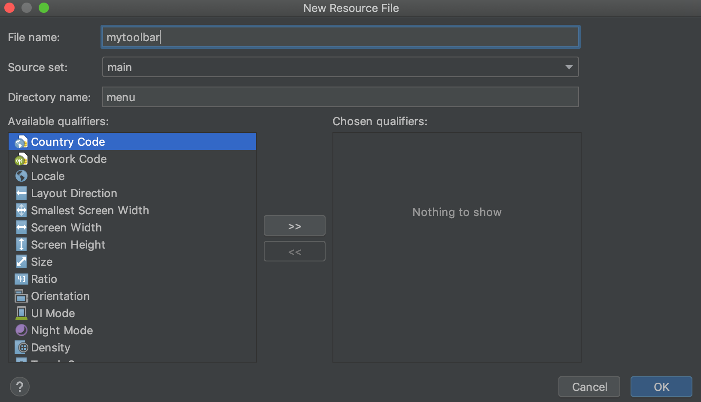

Kita berjumpa lagi di pertemuan yang ke empat, tak terasa sudah sampai pada modul utama, yaitu menambahkan halaman utama aplikas. Untuk mendongkrak semangat teman-teman, **Saya akan memilih aplikasi terbaik dari teman-teman yang ikut HRC ini, kemudian kita akan memasang aplikasi nya di [Google Play](www.play.google.com) hanya satu aplikasi**. Tapi jangan khawatir, saya akan membuat tutorial nya di blog seder hana ini agar semuanya mengerti bagaimana cara mengupload aplikasi ke [google play](www.play.google.com). Untuk systemnya kita akan lakukan di kelas ya :-) .

Oke kita langsung saja menuju tutorial.

**Menambahkan `Action` pada tombol login**
Silahkan berikan aksi pada tombol `login` yang ada pada halaman `LoginScreen`, dan arahkan menuju halaman `MainActivity`.


Jika sudah seksai, kita lanjut ke tutorial selanjutnya.

**Menambahkan `Toolbar` pada halaman `MainActivity`**
1. Tambahkan sebuah folder pada direktori `res` dengan cara 
   - Klik kanan pada folder `res`
   - Pilih `New`
   - Pilih `Android Resource Directory`
   - Atur seperti pada gambar 1
    
    *Gambar 1*
2. Klik kanan pada folder `menu` yang sudah kalian buat kemudian tambahkan sebuah file dengan nama `mytoolbar` cara nya adalah sebagai berikut
    - Klik kanan folder `menu`
    - Pilih `New`
    - Pilih `menu resource file`
    - atu seperti gambar 2
    
    *gambar 2*
3. Buka dan edit file `mytoolbar` seperti code berikut
   ```xml
        <menu xmlns:android="http://schemas.android.com/apk/res/android"
    xmlns:app="http://schemas.android.com/apk/res-auto">
            <item
                android:id="@+id/miCompose"
                android:icon="@drawable/keranjang"
                app:showAsAction="always"
                android:title="Keranjang">
            </item>
        </menu>
   ```
   
**Menambahkan `mytoolbar` kedalam halaman `MainActivity`**
1. Buka file `MainActivity`
2. tambah kode berikut tepat didalam kelas `MainActivity`
   ```java
         @Override
         public boolean onCreateOptionsMenu(Menu myMenu) {
            getMenuInflater().inflate(R.menu.mytoolbar, myMenu);
        return true;
        }
   ```
3. Silahkan jalankan aplikasinya dan lihat hasilnya.


**Menambahkan tombol kiri atas pada aplikasi**

1. Edit dan tambahkan kode berikut kedalam file `MainActivity`
    ```java
        getSupportActionBar().setDisplayShowHomeEnabled(true);
        getSupportActionBar().setDisplayShowCustomEnabled(true);
        getSupportActionBar().setIcon(R.drawable.ic_garis_tiga);
    ```    
2. Jalankan Aplikasi dan lihat hasilnya

**Menambahkan 3 tombol di bawah `Toolbar`**
1. Buka file `activity_main.xml`
2. Edit menjadi seperti code dibawah ini
   ```xml

   ```