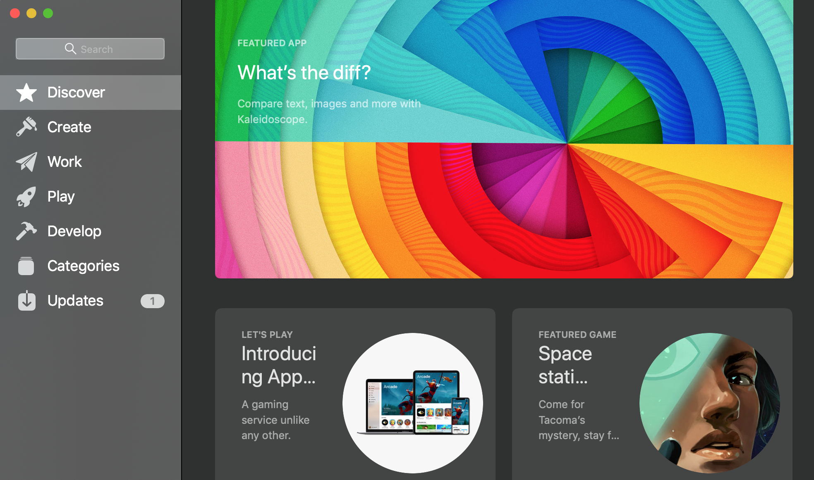

Hi soba ngoding, kali saya khsus membahas tips tips upload aplikasi yang dibuat menggunakan flutter ke playstore.
Sebenarnya flutter sudah membahas tatacara nya ada di blognya flutter cuman pada blog saya ini akan saya tambahkan beberapa hal yang tidak dibahas disana, seperti biasa kita mulai saja tutorial nya dengan simulasi

## Simulasi ##

1. Sudah punya akun google play console, kalau belum punya beli dulu disini [google](console.plastore.com)

2. Sudah ada project flutter

## Langkah -  langkah ##

1. ### Gunakan Android Studio###
2. ### Pastikan Package kalian benar ###
3. ### Buat JKS File ###
4. ### Buat key.propertise ###
5. ### Edit file `project/android/app/build.gradle` ###
6. ### Ganti APP Icon ###

>Penulis bukan orang yang paling mampu, hanya ingin berbagi saja. Semoga dapat mengambil manfaat<small> - Penulis</small>